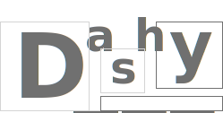
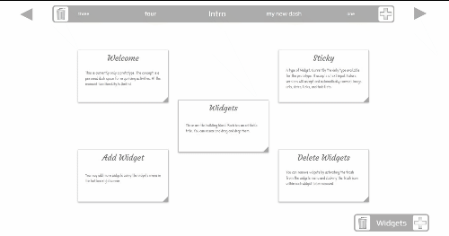

[ v16-geckos-2-production.netlify.com](https://v16-geckos-2-production.netlify.com/)
## v16-geckos-team-02
A personal productivity planning board SPA | Voyage-16 | https://chingu.io/ | Twitter: https://twitter.com/ChinguCollabs



# Features
- Add/remove/rename/navigate dashboards
- Widgets with customizable size, postion and title
    - Sticky: autodetects type based on input
        - Text: accepts markdown input
- Add/remove widgets
- User Dash data is persisted locally and restores on reload

# Development 
[Sandbox deployment](https://v16-geckos-2-sandbox.netlify.com/)
## Local setup
Clone/folk this repo
Run:
```
cd app
npm install 
npm run dev
```
Go to `http://localhost:5000/` in web browser

## Furture release features
- Implement as a PWA
- Enable grid editting (size and position) on long press, disable as default and on single tap
- Improved DashNav: handling of edge cases (when fewer dashes and on smaller screens), swipe left/right to navigate between dashes
- Widget Sticky types (autodetected):
    - Image: accepts a valid image url or drag and drop file upload
    - Link: displays snippet/preview scraped via a backend API
    - Todo: list with clickable tick boxes
    - Date: accepts a date input and displays it
- Widget types: 
    - Time Widget: clock with adjustable UTC, countdown display, time since display
    - Live Widget: weather feed, rss feed...
- backend database: users can access dashboards from multiple devices
- user authentication
- dash sharing links (read-only)
